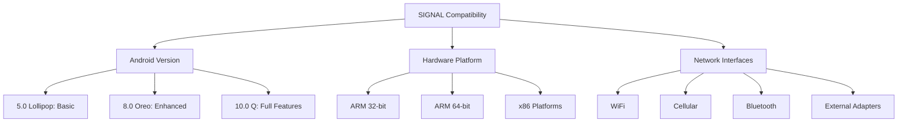

# SIGNAL: Comprehensive Dependencies & Requirements 🛠️

## 🌐 Dependency Ecosystem

### 1. Core System Requirements

#### Operating Systems
- Android 5.0+ (Lollipop)
- Recommended: Android 8.0+ (Oreo)
- Best Experience: Android 10+ (Q)

#### Minimum Hardware Specifications
- Processor: Quad-core 1.4 GHz
- RAM: 2GB (4GB+ Recommended)
- Storage: 100MB free space
- Network Interfaces: WiFi, Cellular Data

### 2. Software Dependencies

#### 1. Termux Environment
- Termux (Latest Version)
- Terminal Emulation
- Package Management

#### 2. Programming Languages
- Python 3.8+
  - `pip` package manager
  - `venv` virtual environment support

#### 3. Network Diagnostic Tools
- Aircrack-ng
- Wireshark (CLI)
- `iw` (Wireless configuration)
- `tcpdump`
- `netstat`

### 3. Python Package Requirements

```python
# requirements.txt
flask==2.1.0
scapy==2.4.5
tensorflow==2.7.0
numpy==1.21.0
requests==2.26.0
pyshark==0.4.3
psutil==5.8.0
```

### 4. Optional Enhanced Tools

#### Wireless Adapters
- External WiFi dongles
- Monitor mode support
- SDR (Software-Defined Radio) dongles

#### Advanced Capture Hardware
- USB OTG Support
- External Network Interface Cards
- Raspberry Pi (for extended analysis)

### 5. Permissions Required

#### Android Permissions
- Network State Access
- Location Services
- WiFi Scanning
- Cellular Data Reading
- Storage Write Access

### 6. Cloud Integration Requirements

#### Cloud Services
- Optional Google Cloud Integration
- Optional AWS Cloud Connectivity
- Secure WebSocket Connections

#### Authentication
- OAuth 2.0 Support
- Secure Token Management
- Anonymized Data Transmission

### 7. Development Environment

#### Recommended Development Tools
- Android Studio
- Visual Studio Code
- PyCharm
- Termux Development Environment

### 8. Compatibility Matrix



### 9. Diagnostic Plugin Architecture

#### Plugin Types
- Network Scanning
- Packet Analysis
- Performance Monitoring
- Cloud Synchronization

#### Plugin Development Requirements
- Python 3.8+
- Type Hinting
- Asyncio Support
- Standardized Interface

### 10. Performance Considerations

#### Resource Management
- Adaptive Sampling Rates
- Configurable Logging Levels
- Background Service Optimization

---

_Empowering Network Intelligence Through Comprehensive Compatibility_

## 🚀 Recommended Setup Path

1. Install Termux
2. Configure Python Environment
3. Install Network Tools
4. Clone SIGNAL Repository
5. Install Dependencies
6. Run Initial Configuration

## 🔍 Diagnostic Readiness Checklist

- [ ] Termux Installed
- [ ] Python 3.8+ Configured
- [ ] Network Tools Installed
- [ ] Wireless Adapter Ready
- [ ] Permissions Granted
- [ ] Initial Setup Completed

---

_Your Gateway to Advanced Network Intelligence_