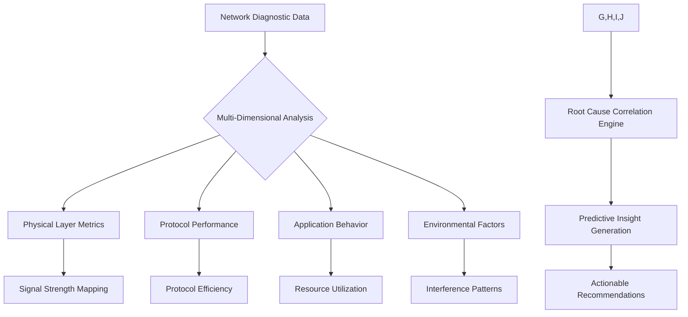
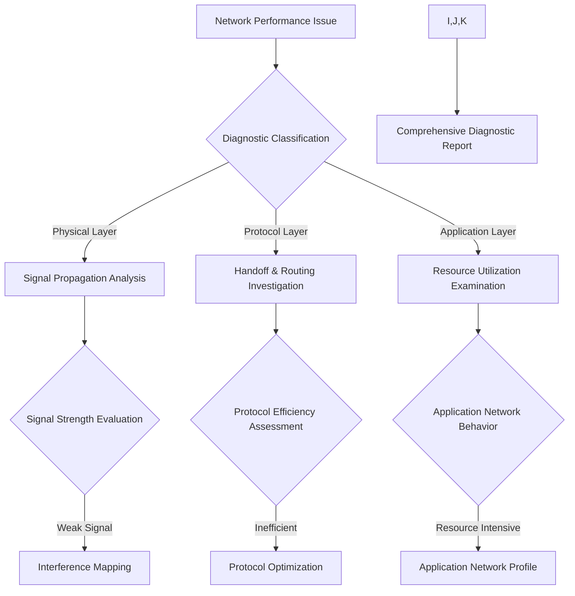

# SIGNAL: Advanced Network Intelligence Diagnostics 🌐🔬

## 🚀 Holistic Network Forensics Framework

### Diagnostic Dimensions

#### 1. Physical Layer Analysis
- Signal Propagation Mapping
- Interference Topography
- Environmental Signal Degradation
- RF Spectrum Occupancy

#### 2. Network Protocol Intelligence
- Protocol Efficiency Scoring
- Handoff Performance Metrics
- Latency Characterization
- Packet Loss Root Cause Analysis

#### 3. Application Behavior Correlation
- Network Resource Utilization
- Application-Specific Performance Profiles
- Background Process Network Impact
- Predictive Bandwidth Consumption

## 🔍 Root Cause Correlation Engine

### Diagnostic Correlation Matrix

## 🌈 Advanced Diagnostic Techniques

### 1. Machine Learning Anomaly Detection
- Unsupervised Learning Models
- Real-Time Deviation Recognition
- Predictive Failure Forecasting
- Adaptive Baseline Establishment

### 2. Geospatial Network Intelligence
- Location-Based Signal Mapping
- Urban Wireless Ecosystem Analysis
- Terrain Interference Modeling
- Multi-Site Performance Correlation

### 3. Comprehensive Visualization Strategies

#### Proposed Google Cloud Visualization Ecosystem
- BigQuery for Massive Data Warehousing
- Dataflow for Real-Time Stream Processing
- Looker for Advanced Data Visualization
- AI Platform for Predictive Modeling

## 🤖 Intelligent Correlation Algorithms

### Root Cause Diagnostic Flow
1. **Data Aggregation**
   - Multi-Source Signal Collection
   - Timestamp Synchronization
   - Contextual Metadata Enrichment

2. **Correlation Analysis**
   - Cross-Dimensional Pattern Recognition
   - Anomaly Scoring
   - Predictive Probability Calculation

3. **Insight Generation**
   - Automated Problem Classification
   - Recommended Mitigation Strategies
   - Confidence-Weighted Suggestions

### Diagnostic Decision Tree

## 🛠️ Advanced Diagnostic Toolkit

### Diagnostic Capture Modes
- Passive Monitoring
- Active Probing
- Stealth Analysis
- Adaptive Sampling

### Data Enrichment Techniques
- Geolocation Tagging
- Temporal Performance Correlation
- Cross-Technology Interference Analysis
- Machine Learning Feature Extraction

## 🌐 Cloud-Powered Intelligence Platform

### Data Processing Pipeline
1. **Capture**: Multi-Dimensional Signal Collection
2. **Preprocess**: Data Normalization
3. **Analyze**: Machine Learning Correlation
4. **Visualize**: Intelligent Dashboard
5. **Recommend**: Predictive Insights

### Google Cloud Technology Stack
- Pub/Sub for Real-Time Data Streaming
- BigQuery for Massive Data Warehousing
- Dataflow for Stream Processing
- AI Platform for Predictive Modeling
- Looker for Advanced Visualization
- Cloud Monitoring for Performance Tracking

## 💡 Unique Diagnostic Capabilities

- **Zero-Configuration Setup**
- **Adaptive Intelligence**
- **Privacy-Preserving Analysis**
- **Continuous Learning**
- **Global Network Insights**

### Visualization Concept Prototypes
- 3D Signal Propagation Heatmaps
- Animated Interference Patterns
- Real-Time Performance Dashboards
- Predictive Network Health Indicators

---

_Transforming Network Complexity into Actionable Intelligence_

## 🚀 Implementation Roadmap
1. Core Diagnostic Framework
2. Machine Learning Model Development
3. Cloud Integration
4. Visualization Prototype
5. Community Validation

---

_Where Data Meets Insight_