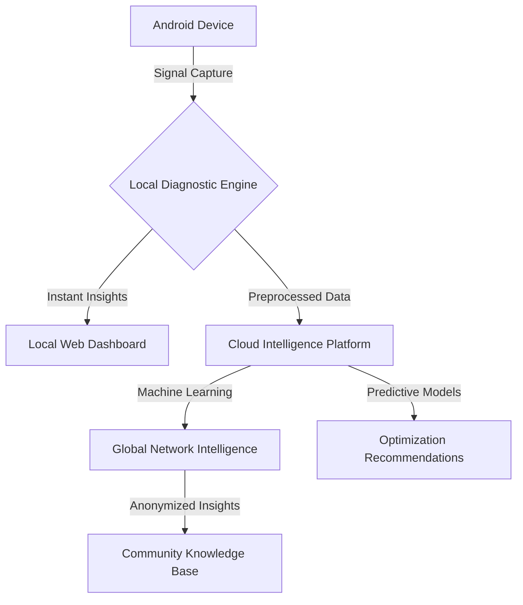

# SIGNAL: Architectural Deep Dive 🏗️🔬

## 🌐 Distributed Network Intelligence Architecture

### Architectural Layers

1. **Device Capture Layer**
   - Multi-Protocol Signal Interception
   - Low-Overhead Monitoring
   - Adaptive Sampling Techniques

2. **Local Processing Engine**
   - Real-Time Signal Analysis
   - Immediate Diagnostic Insights
   - Adaptive Filtering
   - Resource-Efficient Processing

3. **Hybrid Cloud Intelligence**
   - Global Performance Correlation
   - Machine Learning Model Training
   - Advanced Predictive Analytics

## 🔍 Workflow Visualization

## 🛠️ Technical Components

### Signal Capture Mechanisms
- WiFi Monitor Mode
- Cellular Network Probing
- Bluetooth Discovery
- RF Spectrum Scanning

### Processing Techniques
- Adaptive Sampling Rates
- Machine Learning Feature Extraction
- Real-Time Signal Classification
- Interference Pattern Recognition

### Cloud Integration
- Secure Data Transmission
- Federated Learning
- Privacy-Preserving Analytics
- Continuous Model Improvement

## 🔒 Security & Privacy Considerations

- End-to-End Encryption
- Anonymized Data Collection
- User Consent Mechanisms
- Granular Permission Controls

## 📊 Performance Metrics Tracked

- Signal Strength
- Interference Levels
- Bandwidth Utilization
- Latency Characteristics
- Roaming Performance
- Application Network Behavior

## 🌈 Adaptive Intelligence Flow

1. **Local Device Analysis**
   - Immediate Diagnostic Capture
   - Resource-Efficient Processing
   - Instant Visualization

2. **Cloud Intelligence**
   - Global Data Correlation
   - Machine Learning Model Training
   - Predictive Network Insights

3. **Continuous Learning**
   - Adaptive Model Updates
   - Community-Driven Improvements
   - Expanding Diagnostic Capabilities

## 🚀 Technological Innovations

- Dynamic Plugin Architecture
- Zero-Configuration Setup
- Cross-Platform Compatibility
- Privacy-First Design

---

_Transforming Network Complexity into Actionable Intelligence_