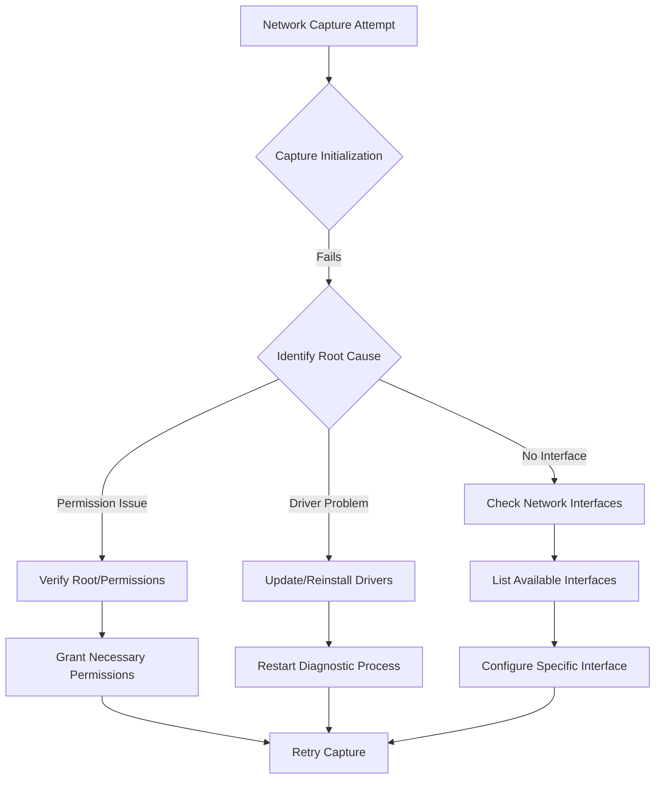
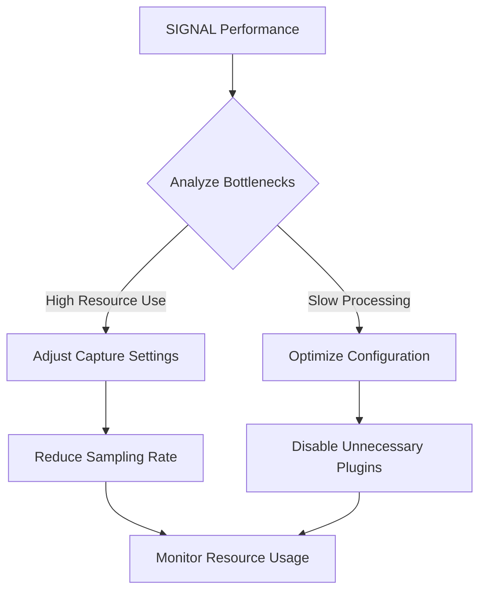

# SIGNAL: Comprehensive Troubleshooting Guide 🛠️

## 🚨 Common Installation Issues

### 1. Termux Installation Problems

#### Scenario: Unable to Install Packages
- **Symptoms**: `pkg update` fails
- **Solutions**:
  1. Update Termux app
  2. Clear app data
  3. Reinstall Termux
  4. Check network connection

#### Scenario: Permission Denied
- **Symptoms**: Cannot install network tools
- **Solutions**:
  1. Use `termux-setup-storage`
  2. Grant storage permissions
  3. Restart Termux

### 2. Python Environment Issues

#### Scenario: Python Not Found
- **Symptoms**: `python3` command fails
- **Diagnostic Steps**:
```bash
# Check Python installation
pkg install python

# Verify Python version
python3 --version

# Create virtual environment
python3 -m venv signal_env
source signal_env/bin/activate
```

### 3. Network Tool Installation

#### Scenario: Aircrack-ng Not Working
- **Symptoms**: Wireless scanning fails
- **Solutions**:
  1. Install with `pkg install aircrack-ng`
  2. Verify monitor mode support
  3. Check wireless adapter compatibility

## 🔍 Diagnostic Flowcharts

### Network Capture Troubleshooting



### Performance Optimization



## 📋 Frequently Asked Questions

### Q1: Do I Need a Rooted Device?
- **Answer**: Not always
- **Recommended**: Rooting provides more advanced features
- **Alternative**: Some features work on non-rooted devices

### Q2: Can I Use External WiFi Dongles?
- **Answer**: Yes!
- **Requirements**:
  - USB OTG Support
  - Monitor Mode Compatibility
  - Driver Support

### Q3: What About Privacy?
- **Answer**: 
  - Anonymized Data Collection
  - User-Controlled Sharing
  - Encrypted Transmissions

## 🛡️ Security Considerations

### Permission Management
- Minimal Permission Requests
- Granular Control
- Transparent Data Usage

### Data Protection
- Local Storage Encryption
- Optional Cloud Sync
- User-Defined Privacy Settings

## 🌐 Community Support

### Reporting Issues
1. Collect Diagnostic Logs
2. Note Device Specifications
3. Describe Exact Scenario
4. Open GitHub Issue

### Recommended Diagnostic Logs
```bash
# Collect System Information
termux-info

# Network Diagnostic Log
signal-network diagnostics --verbose > diagnostic_log.txt
```

## 🚀 Performance Tuning

### Configuration Optimization
```json
{
    "capture_mode": "adaptive",
    "log_level": "minimal",
    "resource_limit": {
        "cpu_percent": 20,
        "memory_mb": 200
    }
}
```

### Resource Management Strategies
- Adaptive Sampling
- Background Processing
- Configurable Intensity Levels

---

_Empowering Your Network Intelligence Journey_

## 💡 Pro Tips
- Regular Updates
- Community Engagement
- Continuous Learning

---

_Your Comprehensive Guide to Seamless Network Diagnostics_