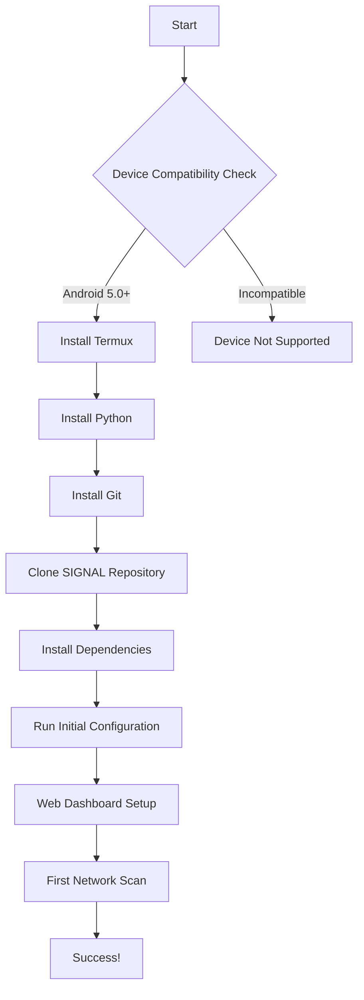
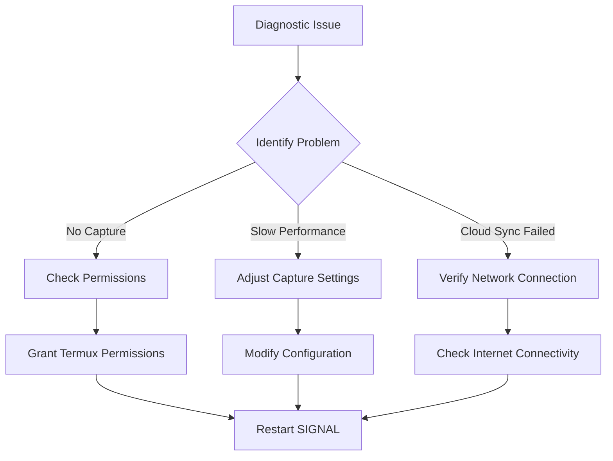

# SIGNAL: Ultimate User Guide 🌐🔍

## 📱 Getting Started: Your Journey into Network Intelligence

### 0. Pre-Requisites: What You'll Need

#### Hardware Requirements
- Android Device (5.0+ recommended)
- Minimum 2GB RAM
- At least 100MB free storage
- Recommended: Devices with 4GB+ RAM for advanced features

#### Software Requirements
1. **Core Requirements**
   - Termux (Terminal Emulation)
   - Python 3.8+
   - Git

2. **Optional but Recommended**
   - Wireless adapter supporting monitor mode
   - Rooted device for advanced features
   - External USB WiFi dongle

### 🛠 Installation Workflow

#### Method 1: OpenClaw Skill Installation
```bash
# Simple one-line installation
openclaw skills install signal-network
```

#### Method 2: Manual Installation
```bash
# Update package repositories
pkg update && pkg upgrade

# Install dependencies
pkg install python git termux-api

# Clone SIGNAL repository
git clone https://github.com/bgorzelic/SIGNAL.git
cd SIGNAL

# Install Python dependencies
pip install -r requirements.txt

# Initial setup
python setup.py install
```

## 🌈 Installation Flowchart



## 🔌 Required Third-Party Apps & Tools

### 1. Termux
- Terminal emulation app
- Provides Linux-like environment on Android
- Essential for advanced network diagnostics

### 2. Wireless Diagnostic Tools
- Aircrack-ng
- Wireshark (command-line version)
- iw
- tcpdump

### 3. Optional Enhancers
- USB OTG
- External WiFi adapters
- SDR (Software-Defined Radio) dongles

## 📡 Packet Capture Capabilities

### Capture Modes
1. **Passive Scanning**
   - Minimal network interaction
   - Low-overhead monitoring
   - Ideal for non-intrusive analysis

2. **Active Probing**
   - Detailed network interrogation
   - More comprehensive insights
   - Potential network performance impact

### Capture Techniques
- Monitor Mode Capture
- Raw Socket Interception
- Kernel-Level Packet Tracing
- eBPF-based Tracing

## 🔬 Logging Mechanisms

### Log Types
1. **Network Diagnostic Logs**
   - Signal strength
   - Interference patterns
   - Connection metadata

2. **Packet Capture Logs**
   - Full packet details
   - Protocol-level analysis
   - Configurable verbosity

3. **Performance Logs**
   - Resource utilization
   - Diagnostic run statistics
   - Error tracking

### Log Storage
- Local SQLite Database
- JSON Flat Files
- Optional Cloud Sync
- Configurable Retention Policies

## 🌐 Advanced Configuration

### Configuration File: `signal_config.json`
```json
{
    "capture_mode": "adaptive",
    "log_level": "detailed",
    "cloud_sync": true,
    "interfaces": ["wlan0", "rmnet0"],
    "packet_capture": {
        "max_file_size": "100MB",
        "retention_days": 7,
        "anonymize_data": true
    }
}
```

## 🚨 Troubleshooting Flowchart



## 🔒 Privacy & Security

- Anonymized Data Collection
- Encrypted Cloud Transmissions
- User-Controlled Data Sharing
- Granular Permission Management

## 🤝 Community Involvement

- Report Bugs
- Suggest Features
- Contribute Diagnostic Plugins
- Share Anonymized Insights

---

_Democratizing Network Intelligence, One Device at a Time_

## 🎓 Learning Paths

1. **Beginner**
   - Basic network scanning
   - Simple dashboard insights

2. **Intermediate**
   - Custom capture configurations
   - Detailed log analysis

3. **Advanced**
   - Plugin development
   - Machine learning model training
   - Global network research

## 📞 Support Channels
- GitHub Issues
- Community Forums
- Discord Server
- Email Support

---

_Your Journey into Network Intelligence Starts Here_